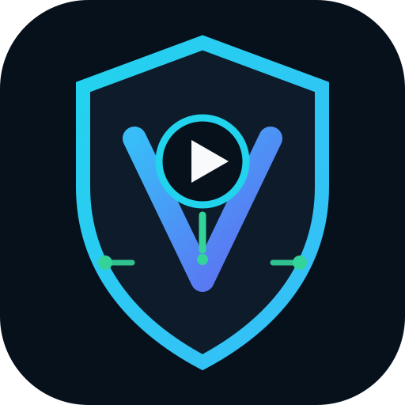
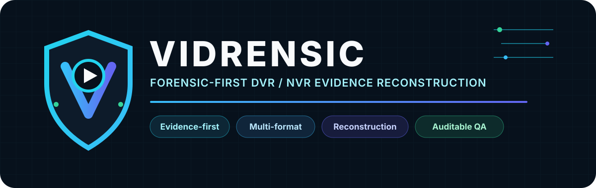

<div align="center">



# Vidrensic

**Forensic-first DVR / NVR evidence reconstruction and video forensics**

Acquire · Triage · Detect · Reconstruct · Validate · Audit

[](https://github.com/imedkablavi/Video-Forensics/actions/workflows/ci.yml)


[](https://github.com/imedkablavi/Video-Forensics/stargazers)

**Recover what the recorder still contains without pretending uncertainty is certainty.**

[Reproducible demo](docs/DEMO.md) · [Support matrix](docs/SUPPORT_MATRIX.md) · [Validation](docs/VALIDATION.md) · [Roadmap](docs/ROADMAP.md) · [Contributing](CONTRIBUTING.md)

</div>



> **Status — 0.5 alpha.** Vidrensic is under active forensic validation. It is not independently certified and must not be represented as a validated replacement for an organization’s required forensic procedures. The project deliberately labels unsupported, ambiguous and unvalidated operations instead of returning confident-looking output.

## Why Vidrensic exists

CCTV evidence often survives after the recorder index does not. DVR/NVR disks may use proprietary circular stores, interleave cameras, fragment recordings, change logical channel slots over time, contain partially overwritten data, or place ordinary Linux filesystems beside raw video regions.

Vidrensic treats those as **evidence reconstruction problems**, not ordinary file recovery.

```text
Recorder / OEM variant
        ↓
Storage topology + filesystem family
        ↓
Index / allocation evidence
        ↓
Record / container framing
        ↓
Codec + native timestamp evidence
        ↓
Reconstruction strategy
        ↓
Validation + provenance
```

## What makes it different

Vidrensic is being designed around failure modes that make surveillance recovery difficult, not around a marketing list of recorder brands.

- **Capability stages instead of a fake supported/not-supported flag.** A family can be detected or profiled without claiming validated recovery.
- **Read-only evidence handling first.** Mounted or write-enabled block devices are rejected by default before parser work.
- **Format + firmware variant awareness.** Vendor, filesystem, container, codec and timestamp evidence are kept separate.
- **Ambiguity is evidence.** Competing fragment paths, uncertain camera mapping and incomplete timestamps remain explicit instead of being silently guessed.
- **Native vs derived data stays separate.** Extracted native payloads, review derivatives, corrected time and cryptographic transforms carry their own provenance.
- **Recovery is tested as an adversarial parser problem.** Bounds, malformed inputs, interrupted acquisition, races, corrupted metadata and packaging are part of CI.
- **Public demo uses synthetic evidence.** A new contributor can exercise detection/recovery without downloading CCTV or trusting a screenshot.

### Design principles

- **Read-only first.** Evidence block devices are rejected by default when write-enabled or mounted.
- **Format + variant aware.** A brand name is not treated as a format specification.
- **Fail closed.** Recognition does not imply recovery support.
- **Preserve ambiguity.** Candidate IDs are not silently promoted to physical camera identities.
- **Native before review copies.** Original payload extraction and hashes stay separate from later presentation formats.
- **Audit important transforms.** Acquisition, known-key crypto and case activity can emit reproducible receipts/audit records.
- **Test the dangerous paths.** Parser bounds, malformed inputs, concurrency, source identity and packaging are part of CI.

## 60-second start

```bash
git clone https://github.com/imedkablavi/Video-Forensics.git
cd Video-Forensics
python3 -m venv .venv
source .venv/bin/activate
python -m pip install -U pip
python -m pip install -e '.[dev]'

vidrensic --version
vidrensic doctor
vidrensic formats list
```

### Try it without any real evidence

```bash
bash examples/run_demo.sh
```

The demo creates a deterministic synthetic DHAV-like recorder source, ranks format evidence, recovers 12 structurally valid frames into two physical channels and emits a manifest. It is covered by a regression test so the public demo cannot silently rot as parsers evolve.

Full walkthrough: [`docs/DEMO.md`](docs/DEMO.md).

Triage an unknown image without writing to it:

```bash
vidrensic triage evidence.raw --out triage.json
vidrensic formats detect evidence.raw --json
```

For a block device, inspect safety first:

```bash
vidrensic source inspect /dev/sdb --json
```

## What 0.5 adds

The 0.5 hardening branch moves Vidrensic from a format-specific recovery prototype toward a forensic platform foundation:

- streaming unknown-recorder triage and bounded/full signature hit maps;
- human-readable byte sizes in CLI ranges;
- streaming DHAV frame recovery with bounded memory;
- DHAV extension metadata parsing and codec cross-checking;
- WFS codec-neutral extraction with evidence-driven `.h264` / `.h265` / `.es` naming;
- incomplete-tail reporting and fail-closed output handling;
- read-only WFS detection enforcement;
- full-disk ddrescue geometry/capacity preflight and FAT32 large-file protection;
- ddrescue map parsing and acquisition verification receipts;
- process-safe audit hash-chain writes and atomic job transitions;
- CRC + geometry validated GPT parsing;
- source identity fingerprints for safer resume workflows;
- native-vs-derived time evidence and clock correction models;
- file, JBOD/concatenation and RAID0 random-access reader foundations;
- generic node-disjoint global reconstruction solver with ambiguity margin;
- audited **known-key** AES-CBC/AES-CTR transformations with key fingerprinting;
- `vidrensic doctor` dependency/runtime diagnostics;
- expanded malformed-input, concurrency, crypto, acquisition and regression tests;
- wheel/sdist build and installed-wheel smoke tests in CI.

## Capability matrix

Vidrensic does not use one misleading `supported=true` flag. Each family reports a maturity stage and concrete operations.

| Family | Stage | Implemented now | Explicit limitation |
|---|---:|---|---|
| **WFS** | `RECONSTRUCT` | detect/profile/date scan, observed WFS framing, local fragment-chain recovery, codec-neutral native extraction, media QC hooks | generic global solver exists but WFS path-dependent global state solving and frame-level overwrite salvage remain research/validation work |
| **DHAV** | `RECONSTRUCT` | validated headers/footers, extension metadata, channel/frame/timestamp parsing, bounded streaming scan, physical-order channel demux, hashes | circular-wrap chronological reconstruction and broader variant/audio extraction validation remain incomplete |
| **Hikvision proprietary** | `PROFILE` | `HIKVISION@HANGZHOU` Master Sector discovery and bounded geometry plausibility analysis | HIKBTREE/data-block variants are not claimed as validated recovery |
| **Annex-B H.264/H.265** | `PARSE` | NAL/parameter-set evidence and codec hints | raw NAL units do not establish recorder identity or wall-clock time |
| **MPEG-PS/PES** | `PARSE` | program-stream/PES detection and generic media handoff | vendor metadata/timestamp variants need profiles |
| **Known filesystems** | `PROFILE` | MBR/GPT plus EXT/XFS/JFS/FAT/NTFS/exFAT/Btrfs/HFS+ signatures without mounting | finding a filesystem does not prove where surveillance recordings live |

Live capability output is authoritative:

```bash
vidrensic formats list
vidrensic formats list --json
```

See [`docs/SUPPORT_MATRIX.md`](docs/SUPPORT_MATRIX.md) for failure-mode coverage.

## Unknown-recorder triage

```bash
vidrensic triage /dev/sdX \
  --out triage.json \
  --sample-size 4MiB \
  --sample-count 5
```

A triage run combines bounded source sampling, storage profiling, ranked format detection and streaming signature mapping. It is intended to answer **what should be investigated next**, not to force a format classification.

For a dedicated signature map:

```bash
vidrensic profile hitmap evidence.raw \
  --range-size 2GiB \
  --out hitmap.json
```

## Acquisition and verification

Plan or run GNU ddrescue while retaining its resumable map:

```bash
vidrensic acquire plan /dev/sdb \
  --output acquisition.raw \
  --map acquisition.map

vidrensic acquire run /dev/sdb \
  --output acquisition.raw \
  --map acquisition.map \
  --case /cases/CASE-001
```

Verify the resulting output/map and emit a receipt:

```bash
vidrensic acquire verify /dev/sdb \
  --output acquisition.raw \
  --map acquisition.map \
  --receipt acquisition-receipt.json
```

The receipt distinguishes finished, bad-sector, non-tried, non-trimmed and non-scraped map regions; records source/range geometry; and can hash both the map and output. An unresolved or unhashed acquisition is not silently labeled complete.

## WFS workflow

Profile uncertain alignment first:

```bash
vidrensic profile wfs-layout evidence.raw \
  --range-size 64MiB \
  --out wfs-layout.json
```

Scan a validated layout:

```bash
vidrensic scan evidence.raw \
  --plugin wfs \
  --date 2026-08-09 \
  --data-offset 64094208
```

Recover one simultaneous boundary:

```bash
vidrensic recover wfs evidence.raw \
  --starts 0,1,2,4 \
  --stop-fragment 1744 \
  --out recovered/09-00 \
  --label 2026-08-09_09-00 \
  --data-offset 64094208
```

Codec naming is evidence-driven. Strong H.264 parameter-set evidence produces `.h264`, strong HEVC evidence produces `.h265`, and uncertain elementary video remains `.es` with a review reason.

## DHAV workflow

```bash
vidrensic formats detect dahua-or-oem.raw --json
vidrensic recover dhav dahua-or-oem.raw --out recovered/dhav
```

Native DHAV frames are preserved by channel and elementary-stream derivatives are hashed. Physical ordering is preserved; it is **not** automatically presented as chronological order across a circular wrap.

## Known-key encrypted data

Vidrensic 0.5 includes an auditable cryptographic primitive layer, not a universal “decrypt DVR” button.

```bash
vidrensic decrypt aes encrypted.bin \
  --output decrypted.bin \
  --mode cbc \
  --key-file key.bin \
  --iv-hex 00112233445566778899aabbccddeeff \
  --padding pkcs7 \
  --receipt crypto-receipt.json
```

Supported primitive modes currently include AES-CBC and AES-CTR with 128/192/256-bit known keys. Receipts record key fingerprints and transform metadata, **never the key bytes**. Vendor-specific key discovery/derivation is not claimed unless a format profile explicitly implements and validates it.

## Time evidence

Recorder-native time and corrected/reference time are separate evidence classes. Unknown recorder timezone remains unknown. Clock correction is derived from explicit anchors and records offset/drift/residual information rather than overwriting the native timestamp.

## Reconstruction engine

The format-neutral recovery layer includes a node-disjoint global solver for competing fragment paths. It optimizes the supplied graph across all starts instead of choosing one camera greedily at a time, and it can measure an alternative-solution margin.

That solver is a foundation. WFS still needs a validated path-dependent state graph before the global solver can replace all local continuation logic.

## Validation states

| State | Meaning |
|---|---|
| `PASS` | Required validation actually ran and no unresolved hard condition remains |
| `REVIEW` | Candidate exists but ambiguity, missing evidence or a diagnostic concern remains |
| `FAIL` | Structural, decoding, timing or integrity evidence is strongly inconsistent |
| `UNKNOWN` | Required validation has not run |

A one-hour duration is not a PASS by itself.

## QA and release gates

CI runs on Python 3.11, 3.12 and 3.13 and currently gates:

```text
ruff
compileall
unit + synthetic regression tests
malformed-input safety tests
coverage >= 70%
CLI smoke tests
package import tests
sdist + wheel build
pip dependency checks
fresh installation of the built wheel
built-wheel smoke tests
public synthetic demo regression
```

See [`docs/VALIDATION.md`](docs/VALIDATION.md) for validation scope and release expectations.

## Repository map

```text
vidrensic/
├── acquisition/       source safety, SMART, ddrescue maps + receipts
├── core/              case, audit, jobs, provenance, time and hashes
├── crypto/            audited known-key crypto primitives
├── io/                file/JBOD/RAID0 random-access readers
├── media/             ffprobe/decode QC + elementary stream helpers
├── profiler/          source, storage, hit-map and triage analysis
├── profiles/          model/firmware data profiles
├── plugins/           WFS, DHAV, Hikvision, Annex-B, MPEG-PS
└── recovery/          graph + global solver foundations

examples/              deterministic synthetic public demo
docs/                  architecture, policy, support, demo, validation
.github/                CI, issue forms, ownership and contribution workflow
CITATION.cff            citation metadata for research/tool references
```

## Forensic safety rules

1. Never repair the evidence source.
2. Prefer a hardware write blocker; software read-only checks are an additional control.
3. Reject mounted/write-enabled block sources by default.
4. Preserve native artifacts and hashes separately from review copies.
5. Treat signatures as evidence, not certainty.
6. Preserve ambiguity instead of inventing camera/fragment identity.
7. Never invent missing timestamps or timezone evidence.
8. Bound parser-controlled lengths, offsets and table counts.
9. Never store cryptographic key bytes in logs or receipts.
10. Do not advertise a family/model as recoverable when only detection or profiling exists.

## Contributing

High-value contributions include parser fixtures, corruption cases, format documentation, test vectors, safety hardening and reproducible bug reports. Start with [`CONTRIBUTING.md`](CONTRIBUTING.md).

Have a recorder/firmware variant Vidrensic does not understand yet? Use the **New DVR / NVR format request** issue form and read [`docs/SAMPLE_SUBMISSION.md`](docs/SAMPLE_SUBMISSION.md) before sharing any sample material. Never upload active-case CCTV, credentials or cryptographic keys to a public issue.

Security issues should follow [`SECURITY.md`](SECURITY.md), not a public issue.

Research users can cite the project through [`CITATION.cff`](CITATION.cff); once that file is present on the public default branch GitHub can expose its citation metadata directly.

If Vidrensic is useful to your research or lab work, a GitHub star helps other practitioners discover the project.

## Roadmap

Near-term engineering priorities:

- WFS path-dependent global reconstruction graph;
- frame-level partial-overwrite salvage;
- DHAV chronological circular-wrap reconstruction and audio extraction validation;
- Hikvision HIKBTREE/data-block variant parsers backed by real fixtures;
- E01/Ex01/AFF4 adapter strategy with independent verification;
- RAID parity and recorder-specific multi-disk hypotheses;
- synchronized multi-camera review workstation;
- forensic export/report packages and stronger signed provenance;
- larger known-good + intentionally corrupted validation corpus.

Full roadmap: [`docs/ROADMAP.md`](docs/ROADMAP.md).

## Ownership and license

Project owner / lead developer: [`@imedkablavi`](https://github.com/imedkablavi)

Copyright © 2026 imedkablavi. All rights reserved.

Vidrensic is proprietary software. Repository visibility does not grant permission to redistribute, sublicense, sell, publish, host or incorporate the source into another product. See [`LICENSE`](LICENSE), [`NOTICE.md`](NOTICE.md) and [`AUTHORS.md`](AUTHORS.md).

Public launch settings and owner-only decisions are tracked in [`docs/PUBLIC_LAUNCH.md`](docs/PUBLIC_LAUNCH.md).

---

<div align="center">

**Vidrensic — reconstruct the recording, preserve the evidence.**

</div>
